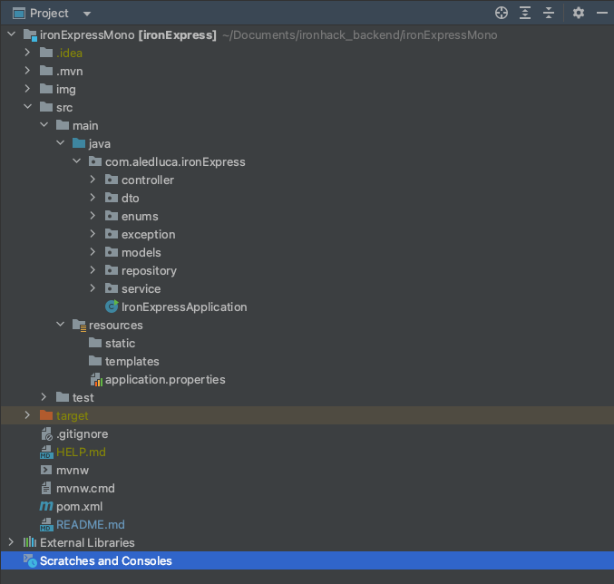

# IronExpress
_by Lucas Basilio Aledi, May 2023_

This is the final project for Ironhack Java Backend Bootcamp.

## Summary
* These RESTful APIs have been developed for an e-commerce platform called IronExpress. They perform all the basic CRUD operations 
that any online platform requires on a daily basis, with the addition of user validation (via tokens) at every step.

### Use Case Diagram


### Class Diagram


### Installation
* Before running the API server, make sure to follow these steps:
1. Create database `ironexpress`
```
postgres=# CREATE DATABASE ironexpress
```
2. Create a schema called `public` in `ironexpress` database 
```
postgres=# CREATE SCHEMA public;
```
3. Create a role `ironexpressadmin` with password `root`
```
postgres=# CREATE USER ironexpressadmin PASSWORD 'root';
```
4. Grant privileges (like the ability to create tables) on new schema to new role
```
postgres=# GRANT ALL ON SCHEMA public TO ironexpressadmin;
```
5. Grant privileges (like the ability to insert) to tables in the new schema to the new role
```
postgres=# GRANT ALL ON ALL TABLES IN SCHEMA public TO ironexpressadmin;
```
6. Update the database configuration inside [application.properties](src/main/resources/application.properties) file.
```
#changing the server port
server.port=8080

#db specific properties
spring.datasource.url=jdbc:postgresql://localhost:5432/ironexpress
spring.datasource.driver-class-name=org.postgresql.Driver
spring.datasource.username=ironexpressadmin
spring.datasource.password=root
```

## Tech Stack
* Java
* Spring Framework
* Spring Boot
* Spring Data JPA
* Hibernate
* PostgreSQL

### Main modules:
- Log in/out
- Seller
- Customer
- Product
- Cart
- Order

### Features
* Customer and Seller authentication & validation with session token having validity of 1 hour for security purposes
* Seller Features:
    * Only registered seller with valid session token can add/update/delete products from database
    * Seller can access the details of different customers, orders
* Customer Features:
    * Registering themselves with application, and logging in to get the valid session token
    * Viewing different products and adding them to cart and placing orders
    * Only logged-in user can access his/her own orders, cart and other features.

### Project structure



### Endpoints
#### Login & Logout Module
* `POST /register/customer` : Register a new customer
* `POST /login/customer` : Logging in customer with valid mobile number & password
* `POST /logout/customer` : Logging out customer based on session token
* `POST /register/seller` : Register a new seller
* `POST /login/seller` : Logging in Seller
* `POST /logout/seller` : Logging out Seller based on session token

#### Customer Module
* `GET /customer/current` : Getting currently logged in customer
* `GET /customer/orders` : Getting order history of logged in customer
* `GET /customers` : Getting All customers
* `PUT /customer` : Updates logged in customer
* `PUT /customer/update/password` : Updates customer password
* `PUT /customer/update/card` : Updates credit card details
* `PUT /customer/update/address?type=home` : Updates customer's home address
* `PUT /customer/update/credentials` : Updates email address and mobile number
* `DELETE /customer` : Deletes logged in user with valid session token
* `DELETE /customer/delete/address?type=home` : Deletes customer's home address

#### Seller Module
* `GET /seller/{sellerid}` : Gets seller with passed seller Id
* `GET /seller/current` : Gets seller details for currently logged in seller
* `GET /sellers` : Gets all sellers
* `POST /addseller` : Adding new seller
* `PUT /seller` : Updates seller details
* `PUT /seller/update/password` : Updates seller password
* `PUT /seller/update/mobile` : Updates seller mobile number
* `DELETE /seller/{sellerid}` : Deletes seller with passed id

#### Product Module
* `GET /product/{id}` : Gets product with given product id
* `GET /products` : Gets all products
* `GET /products/{category}` : Gets product with given category
* `GET /products/seller/{id}` : Gets product of given seller id
* `POST /products` : Adds a new product to database
* `PUT /products` : Updates the product with given product id
* `PUT /products/{id}` : Updates product quantity
* `DELETE /product/{id}` : Deletes product with given id

#### Cart Module
* `GET /cart` : Get all items in Customer Cart
* `POST /cart/add` : Add item to Cart
* `DELETE /cart` : Remove item from Cart
* `DELETE /cart/clear` : Clear entire cart

#### Order Module
* `GET /orders/{id}` : Gets order details with given order id
* `GET /orders` : Gets all orders
* `GET /orders/by/date` : Gets orders placed on given date (DD-MM-YYYY)
* `POST /order/place` : Places a new order based on cart items
* `PUT /orders/{id}` : Updates a pending order
* `DELETE /orders/{id}` : Cancels an order

### Additional Links
- [Google Slides presentation](https://docs.google.com/presentation/d/1qrvp-wPnJV7yQzta0Up2ELuGWhqELGCaep5tZFe_smw/edit?usp=sharing)

### Upcoming work
- Implement spring security to replace token verification by role assignment
